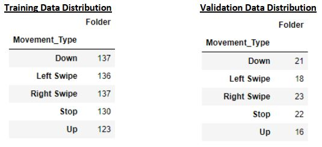
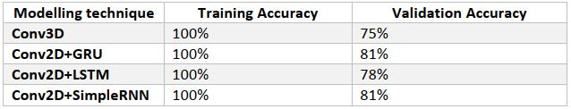

## Gesture Recognition

*Author : Anugraha Sinha*

*Email  : anugraha[dot]sinha[at]gmail[dot]com*

### Problem Statement

The problem involves the recognition of gestures (5 kind of gestures) using different architectures of Neural Network. 
Gestures can be treated as small video sample, which the network should evaluate and categorize them to be belonging 
to one of the 5 given gestures.

### Data Provided
The data provided consists of following parameters
1. Video files : 30 frames per video file (Frames given in PNG format)
2. 1 Frame – 3 channel (RGB)
3. Training data frame size
   * (360,360,3)
   * (160,120,3)
4. Number of training video = 663
5. Number of validation videos = 100

### Data Preparation
(Image Resizing Details)
We have prepared a function called image_processor function, which provides cropped frames in each video when reading data.

1. **Case when original frame size – (360,360,3)**

In such cases, we use python’s skimage.transform.resize function to resize the image as per user provided shapes. This has been done because this package internally provides resizing with reference to center.

2. **Case when original frame size – (160,120,3)**

In this case, we have built our own logic to trim the image appropriately as per user provided target image size.

#### (Sequence List Generation)
We have also build a specific sequence list generation function, which provides the option to select only a series of selected frame from each video. This function provides 3 options
1. choiceoflist = 0
   * In this, a list of all 30 frames is returned.
2. choiceoflist = 1
   * In this, a list of only alternate number between 0,30 is returned.
3. choiceoflist = 2
   * In this, a customized frame list `([0,1,2,3,4,5,6,9,12,15,18,21,24,25,26,27,28,29])` is returned. The idea is that we pick up all initial frames, jump over alternate frames in the middle, and then pick up all frames from the end. This is because, the frames in the middle, would generally have similar information and not help in model’s learning process.

#### (GENERATOR FUNCTIONS)
We have built a specialized generator function, which is common when doing modelling for either Conv3D NN models, or Conv2D+RNN Models. The functions works as follows:

This is heart of complete training process. It pumps batched data to network during learning and prediction both. The function description is given below
    
- Arguments
    1. Source Path - Directory path to be considered for reading video/images frames
    2. folder_list - Lines from the train_doc we read above.
    3. batch_size - The batch_size we want to select.
    4. transform_size - The image transformation size we (Default - (120,120)
    5. frame_selection_list - frame_list obtained from frame_generator (Default - range(30))
    6. process_input_func - To be provided in case CNN2D+RNN type modelling being done
    7. base_model - To be provided in case CNN2D+RNN type modelling being done.

#### Working
- (Case when CNN3D modelling being done)
In this case, for each batch (according to batch size), we build
   1. batch_data = (batch_size, number_of_frames,image_size_x,image_size_y,n_channels)
   2. We normalize each channel (RGB) by dividing the pixel value with 255.

- Case when CNN2D+RNN modelling being done (RNN can be any of SimpleRNN/LSTM/GRU)
    In this case, for each batch (according to batch size), we build
    1. batch_data = (batch_size, number_of_frames,image_size_x,image_size_y,n_channels)
    2. reshape batch data as batch_data.reshape(batch_size * number_of_frames , image_size_x , image_size_y , n_channels).
    3. Above reshaped numpy array is sent to process_input_func of the pre-learned CNN2D function. This will produce 
       modified image vector as per pre-learned CNN2D function (like VGG19/VGG16/etc.)
    4. After process_input_func we reshape again to (batch_size, number_of_frames, outputs from CNN2D vector)

#### Final Output
The final output of the function has a tuple which has the batch_data (processed) and one-hot-encoded Y variable. One-hot-encoded numpy array will be of size (batch_size, 5) since we have 5 kind of gestures.

### Model Building

#### CNN3D (Convolution Neural Network) Type Networks
We have chosen an architecture that resembles a VGG type architecture. However, smaller in nature. Our basic principle was to have Feature Extraction Layer(s) and a Dense Fully Connected(s). We have experimented extensively with different parameters and details are mentioned below
    
- Convolution Layer Design
  * Conv3D-N (Kernel (3,3,3)) – Padding Same -> N means the number of feature maps being output at this layer
  * Activation Relu
  * Batch Normalize
  * Conv3D-N (Kernel (3,3,3))
  * Activation Relu
  * Batch Normalize
  * MaxPool3D (Kernel (2,2,2))
  * Dropout 0.25
    
- Fully Connected (FC) Layer Design
  * Dense(N) -> N means the number of Neurons in the FC layer
  * Activation Relu
  * Dropout
        
#### CNN2D+GRU Network / CNN2D + LSTM Network / CNN2D + SimpleRNN Network Modelling Technique
We use a CNN2D pre-learned model (VGG19) model to build features from it. These features are then fed to a GRU network for categorizing them into 1 of the 5 gestures. We will use (120,120,3) dimension of image data. Bigger than Conv3D type modelling technique. This is done because we are using 2 models here Conv2D and RNN, so having more features is helpful. Lesser number of points will reduce the number of features. The method to obtain output from VGG19 has been embedded in GENERATOR functions as described above. We will describe the different experiments that we did for GRU architecture below.
    

#### Cross Validation
For individual cross validation information, check respective directories.

### Modeling Results and Comparison

#### Important Points
1. It is important to note that Conv3D and Conv2D+LSTM have very high number of parameters for learning. And we can see that there validation data accuracy is lesser than others. Conv2D + GRU seems to be doing best and also Conv2D + SimpleRNN.
2. CNN3D model size (h5 file size) is also very large, because of high number parameters, weight values and network architecture details. From that perspective also CNN3D may not be an ideal modelling technique for smaller devices (like smartphones, IOT devices etc.).
3. Looking at the confusion matrix, there seems to be a miss happening when differentiating between SWIPE LEFT and SWIPE RIGHT. Obviously these 2 movements are like mirror of each other, and so it can be a problem for model to differentiate them as we are doing time-series type analysis. Therefore, we should consider increasing training data for all 5 gestures, so that model is able to differentiate between such gestures.
4. Another way to achieve better accuracy is to build 2 CNN3D (Conv3D) networks. One which works on low resolution images, and other which works on high resolution images. A research paper from NVIDIA where such modelling technique was tested for gesture detection using Conv3D networks.

[Nvidia Gesture Recognition Paper](https://research.nvidia.com/sites/default/files/pubs/2015-06_Hand-Gesture-Recognition/CVPRW2015-3DCNN.pdf)